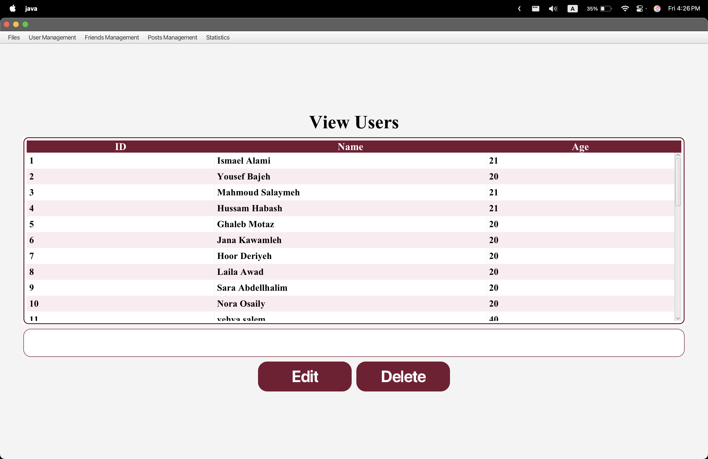

# Data-Structure-Advanced-Social-Network-Management-System

Advanced Social Network Management System

This is my COMP242 Project #2 — a simple **social network simulation** built in Java, using **custom Linked List data structures**.

The system allows users to:
- Create profiles
- Add/remove friends
- Create and share posts
- View posts shared with them
- Generate reports (who posted what, who shared with whom)
- Manage friendships & posts through a GUI (JavaFX)

---

## Features

✅ Built using **custom Linked List data structures** for managing users, friends, and posts  
✅ Load data from files (users, friendships, posts)  
✅ Add, delete, update users  
✅ Add/remove friends  
✅ Create/delete posts  
✅ See posts shared with each user  
✅ Sort friends (A-Z or Z-A)  
✅ Generate reports and save them to files  

## Screenshots of the App

